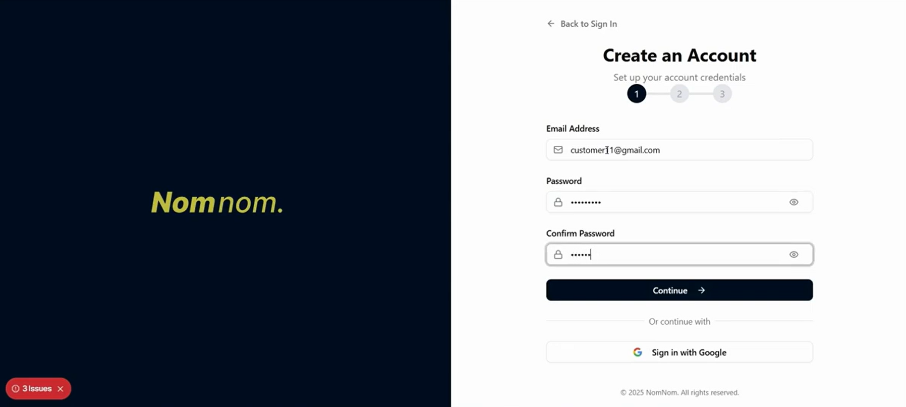
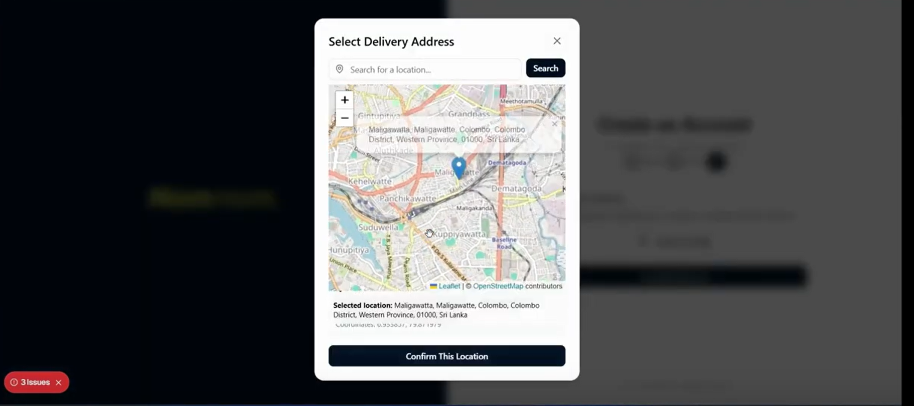
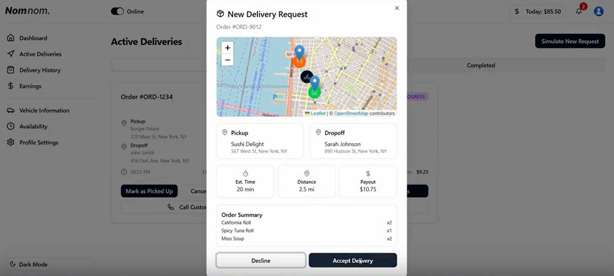
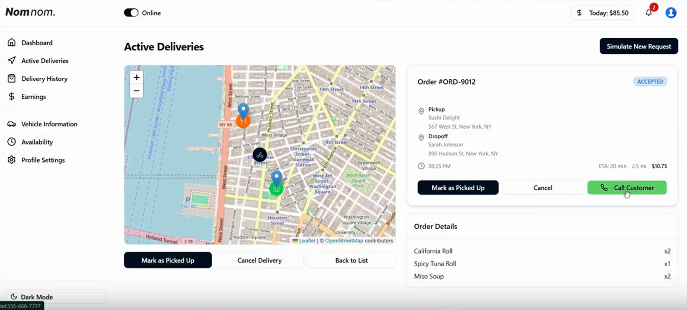
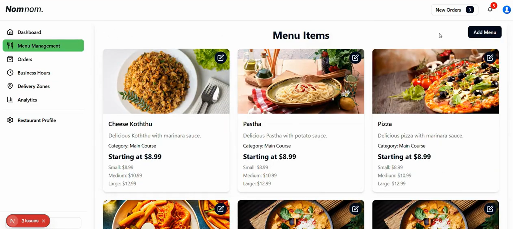
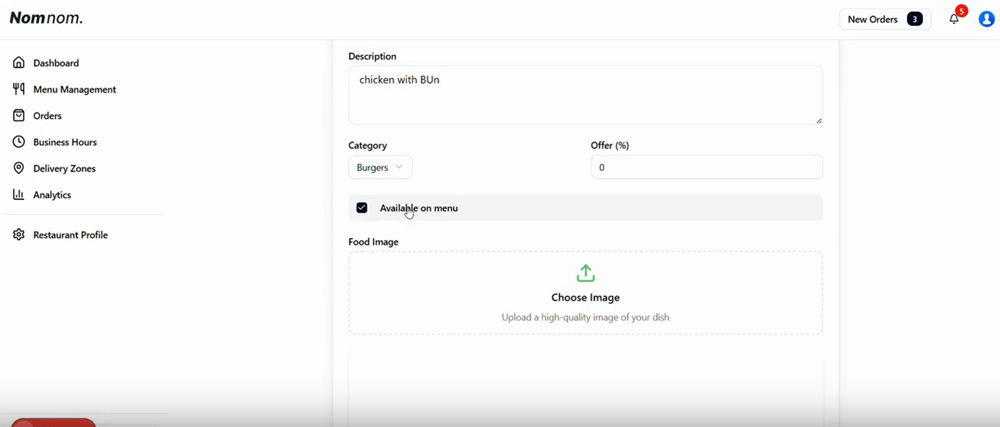
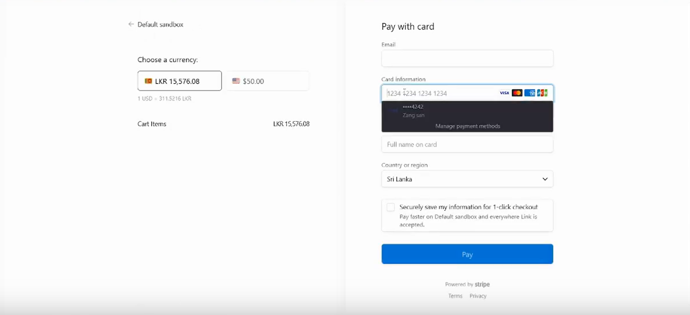
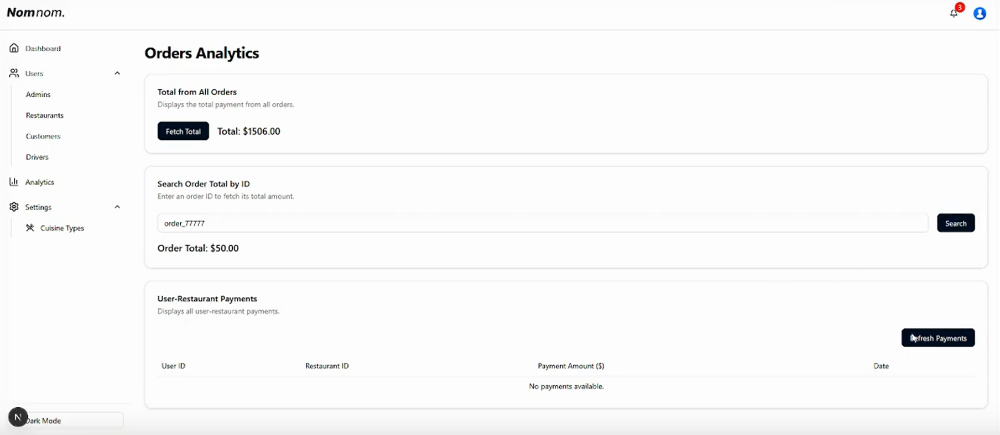
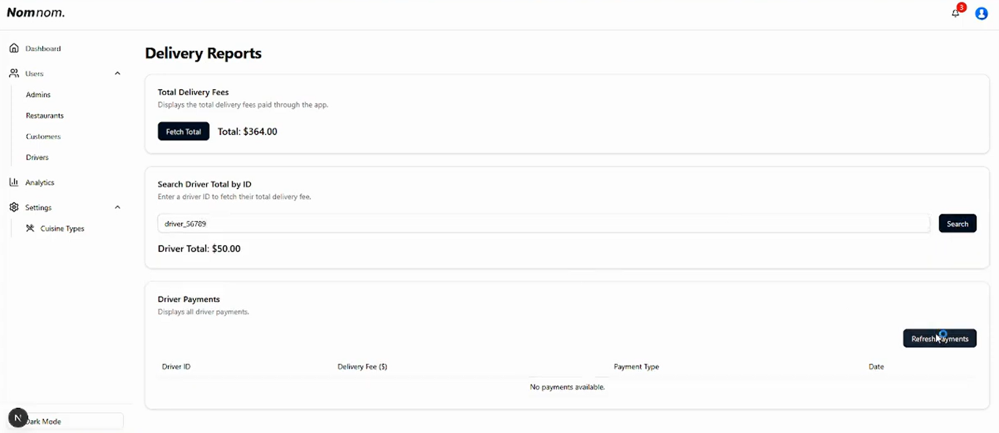

# 🍔 Food Ordering & Delivery System

<div align="center">
  
</div>

---

## 📖 Introduction

<p>
The <b>Food Ordering & Delivery System</b> is a modern web application designed to simplify the process of ordering and delivering food.  
It provides a seamless experience for <b>customers</b>, <b>restaurant admins</b>, and <b>delivery staff</b>, ensuring efficiency and convenience at every step.  
Users can browse menus, add items to the cart, place orders, track deliveries, and make secure payments – all within a responsive and user-friendly interface.  
</p>

<p>
✨ <b>Highlights:</b>  
- Interactive and clean UI  
- Secure authentication & authorization  
- Order tracking with live updates  
- Easy deployment via <b>Docker</b> 🐳 and <b>Kubernetes</b> ☸️  
</p>

---

## 🐳 Deployment with Docker

<p>
Follow the steps below to deploy the system locally using <b>Docker</b>:
</p>

1. Navigate to the backend directory:
   ```bash
   cd backend
Start the services using Docker Compose:

bash
Copy code
docker-compose up --build
Verify that all services are running:

bash
Copy code
docker ps
Access the application:
👉 <a href="http://localhost" target="_blank">http://localhost</a>

☸️ Deployment with Kubernetes (kind)
<p> Deploy the system using <b>Kubernetes</b> with <code>kind</code>: </p>
Create a kind cluster:

bash
Copy code
kind create cluster --name nomnom-system
Load Docker images into the kind cluster:

bash
Copy code
kind load docker-image <image-name> --name nomnom-system
Navigate to the Kubernetes manifests directory:

bash
Copy code
cd kubernetes
Deploy the application:

bash
Copy code
kubectl apply -f .
Monitor the deployment:

bash
Copy code
kubectl get pods -n nomnom-system
kubectl get services -n nomnom-system
Access the application:
Forward the API Gateway port:

bash
Copy code
kubectl port-forward service/api-gateway 8080:80 -n nomnom-system
👉 Then open in your browser:
http://localhost:8080

🖼️ System Screenshots
<div align="center">           </div>
📝 Notes
<p> ⚡ Before deployment, ensure all <code>.env</code> files are correctly configured. For production use: </p>
✅ Managed Kubernetes service

✅ Store secrets using Kubernetes Secrets

✅ Enable TLS & ingress

✅ Add monitoring tools for performance
